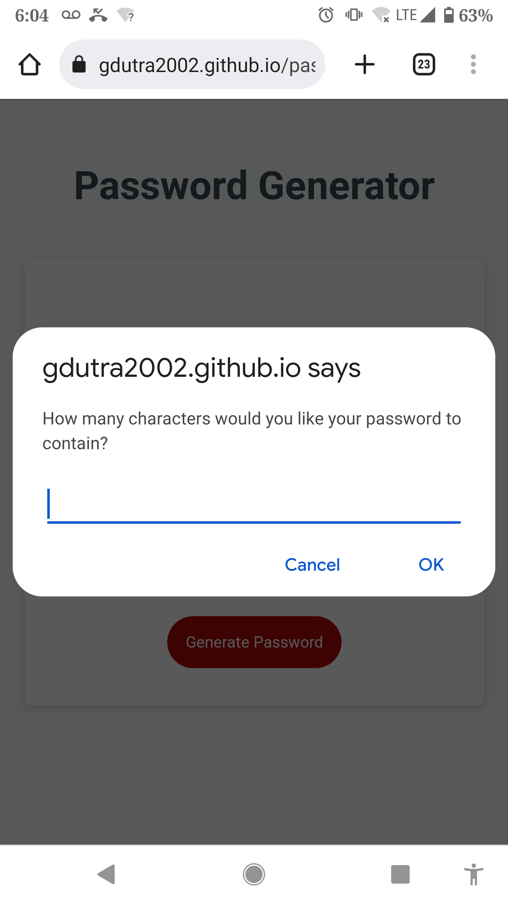

# passcodegenerator

## Description

This page prompts a user to generate a password based on unique password criteria.  

- A length requirement of at least 8 characters, and no more than 128 characters.

- Prompt(s) to include lowercase, uppercase, numeric, and/or special characters.

- When at least one character type is selected, a duodecimal based password is generated and displayed, matching the above criteria.

- In the development and usage of this password generator, an underlying current of knowledge and information begins to emerge. There are a few themes hard to describe, that for simplicity of this idea, we may assign the arbitrary name of 'mathematics.' Concerning that of which is know and unknown, listed in this case, an end user's expectation to receive a randomly unique password sequence from prompt, the developers reliance on knowledge of previous developer's for codebase, the machine level programming and hardware assembled by many, built on elements that function based upon the existence of natural 'mathematics.'  Each of these steps relates to one another in a framework understood one piece at a time in the human mind, coming together in symphonies of functionality, a passcode generator.

## Installation

https://gdutra2002.github.io/passcodegenerator/

## Usage

## Credits

- UC Davis Coding Bootcamp
- MDN https://developer.mozilla.org/en-US/

## License

MIT License

## Badges

Check out the badges hosted by [shields.io](https://shields.io/). 

## How to Contribute

- Contact the developer thru LinkedIn for further inquery or request for your specific custom build.  See the Portfolio project within the GitHub repository hosting this page for the link to profile.

